# Manuel d'Utilisation ImmoPro - Guide Étape par Étape

Ce guide explique individuellement chaque écran et chaque étape de l'utilisation de votre plateforme.

## 1. Page d'Accueil Principale
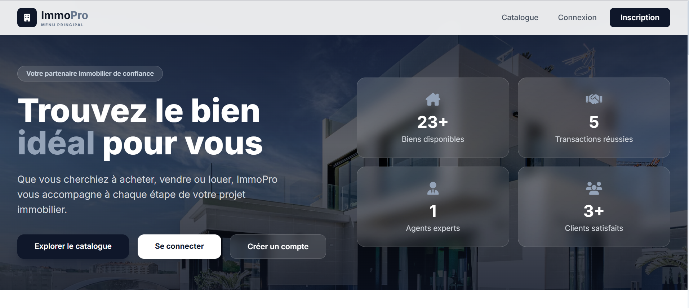
La page d'accueil de la plateforme ImmoPro offre une vue globale sur les chiffres clés de l'agence (biens disponibles, transactions, etc.) et invite l'utilisateur à explorer le catalogue.

## 2. Menu de Navigation Mobile / Rapide
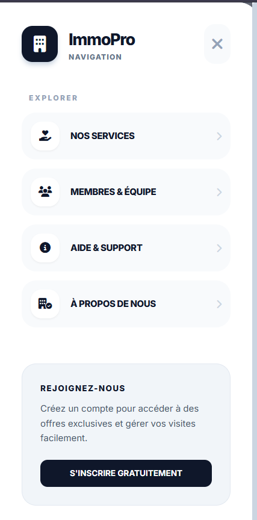
Ce menu latéral permet d'accéder rapidement aux rubriques principales du site : services, équipe, support, ou encore l'inscription.

## 3. Section des Biens Récemment Publiés
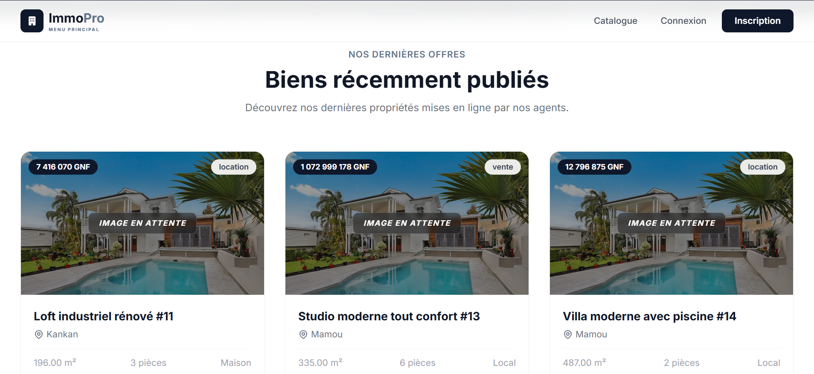
Aperçu des dernières propriétés ajoutées par les agents immobiliers, présentées sous forme de cartes claires.

## 4. Présentation des Services

Explication des trois piliers de l'agence : la vente, la location, et la gestion locative.

## 5. Présentation de l'Équipe

Mise en avant des directeurs et agents responsables de l'agence immobilière pour instaurer la confiance.

## 6. Pied de Page et Appel à l'Action

Dernière section de la page d'accueil invitant à créer un compte, avec les informations de contact et réseaux sociaux.

## 7. Page de Connexion
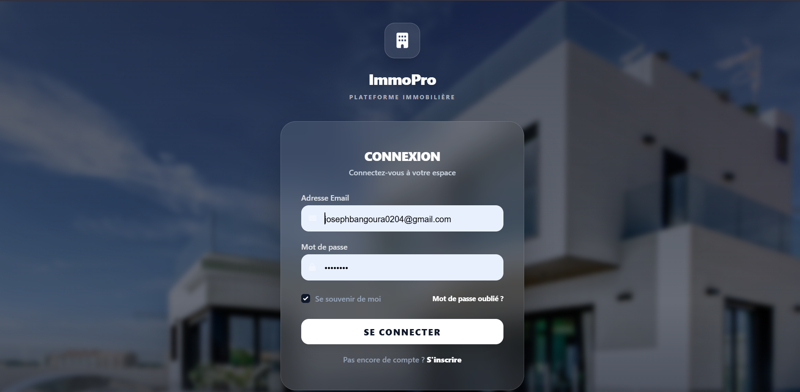
Interface épurée permettant aux utilisateurs (clients ou agents) de se connecter à leur espace personnel.

## 8. Page d'Inscription
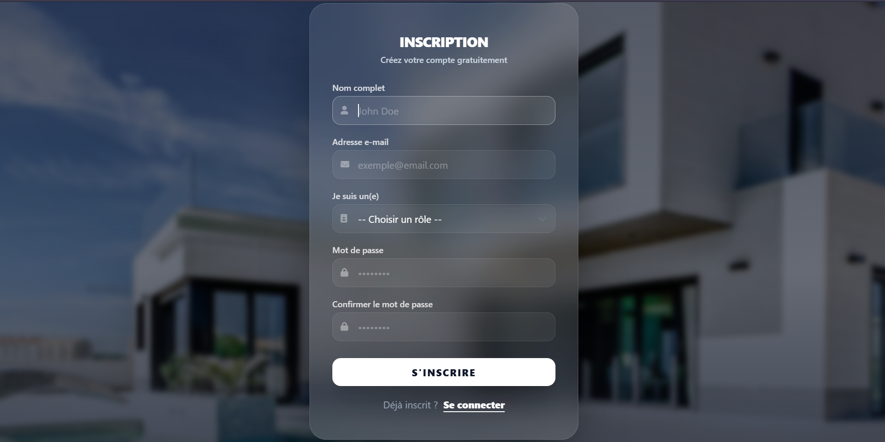
Formulaire de création de compte gratuit demandant le nom, l'email, le rôle souhaité et un mot de passe.

## 9. Tableau de Bord - Vue d'Ensemble
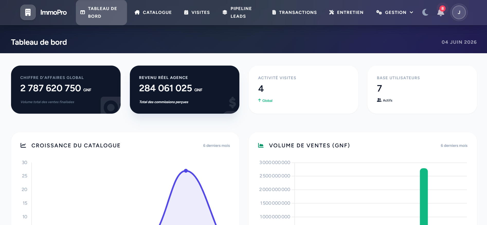
Le dashboard principal de l'administration, affichant le chiffre d'affaires, les revenus réels, et les graphiques de croissance.

## 10. Tableau de Bord - Performances
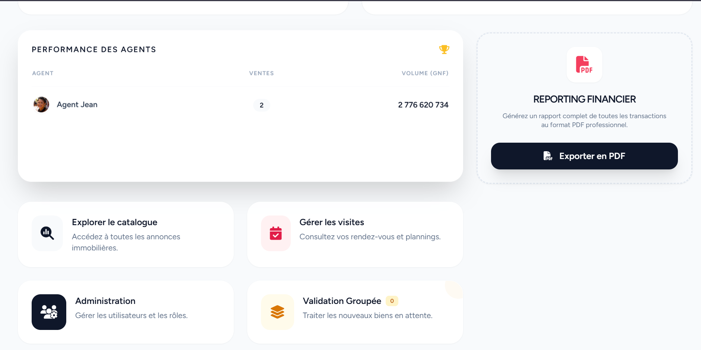
Suite du tableau de bord affichant le classement et les ventes des agents, ainsi que des accès rapides vers d'autres modules.

## 11. Barre de Navigation de l'Espace Agent

Le menu supérieur de l'espace administration pour basculer entre le catalogue, les visites, les leads et les transactions.

## 12. Catalogue Immobilier - Recherche

Filtres avancés permettant aux agents de rechercher des biens par lieu, type, nature, prix, ou surface.

## 13. Catalogue Immobilier - Liste des Biens
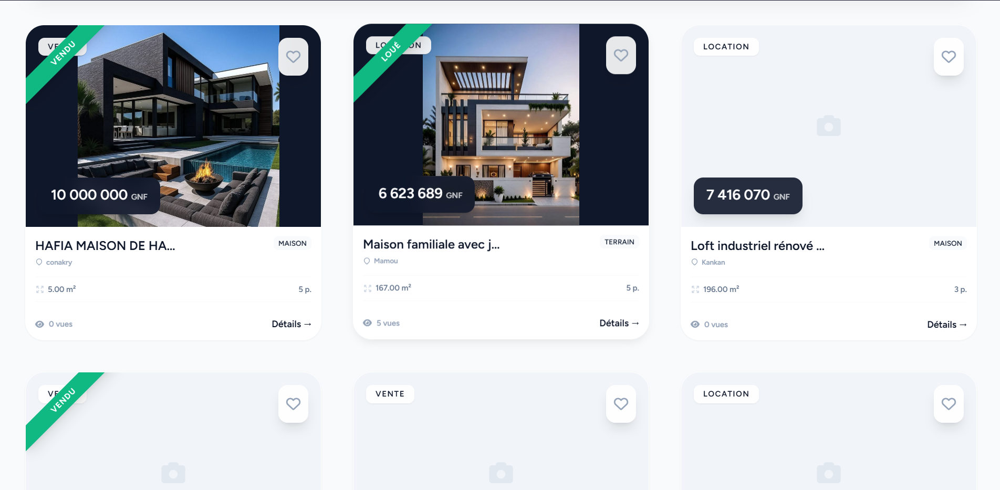
Affichage en grille de l'ensemble des propriétés avec leurs caractéristiques de base et leur statut (Vendu, Loué, etc.).

## 14. Détails d'un Bien - Informations Principales

Vue détaillée d'une propriété spécifique, affichant son statut actuel, sa galerie photo et la possibilité de générer une fiche PDF.

## 15. Détails d'un Bien - Fiche Technique
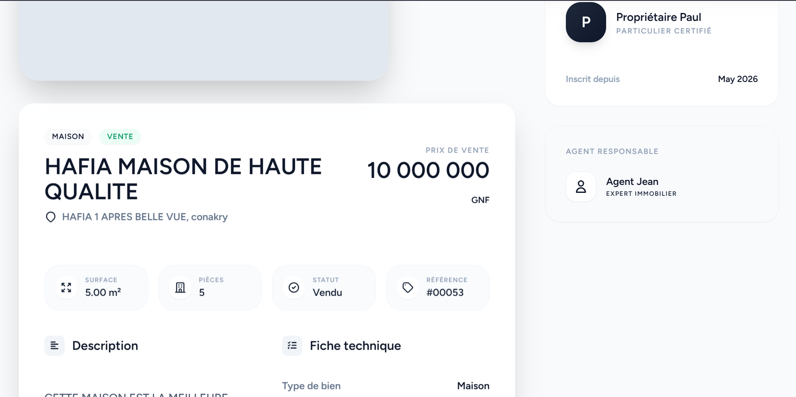
Informations complètes sur le bien : prix, adresse, caractéristiques, description détaillée et l'agent en charge.

## 16. Détails d'un Bien - Carte et Localisation
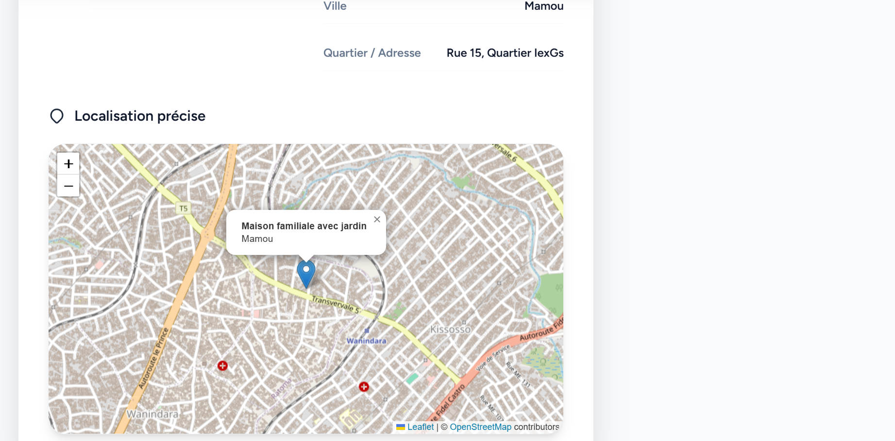
Intégration d'une carte interactive (OpenStreetMap) pour localiser précisément le bien.

## 17. Formulaire d'Ajout d'un Bien - Étape 1
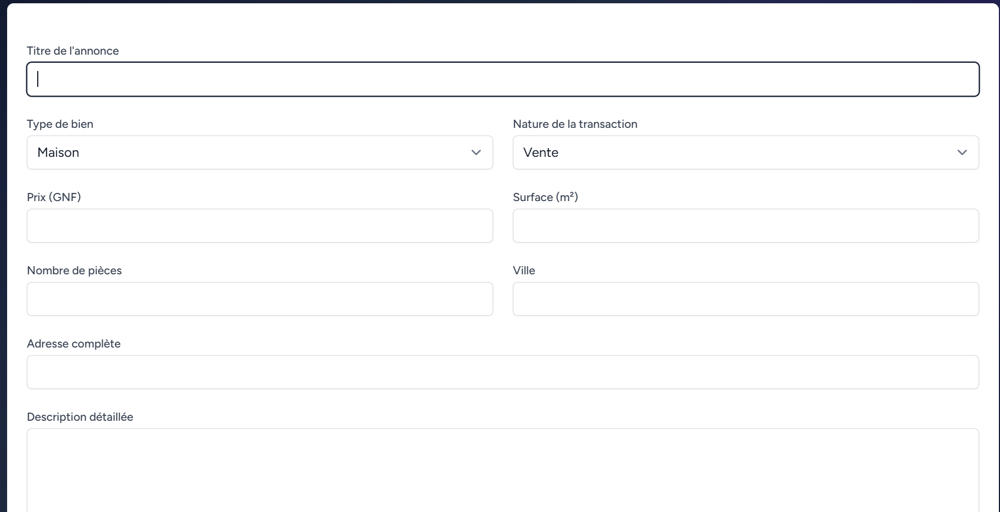
Interface de création d'annonce avec les champs de saisie pour le titre, le type, le prix, la surface et la description.

## 18. Formulaire d'Ajout d'un Bien - Étape 2
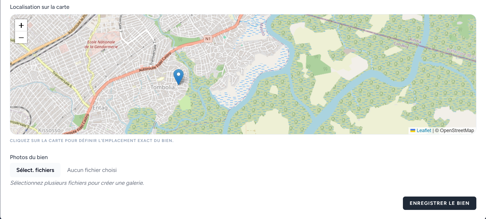
Suite du formulaire d'ajout permettant de placer un marqueur sur la carte et d'importer les photos du bien.

## 19. Gestion des Rendez-vous et Visites

Planning des visites prévues ou effectuées par les agents pour chaque propriété.

## 20. Pipeline des Ventes & Leads
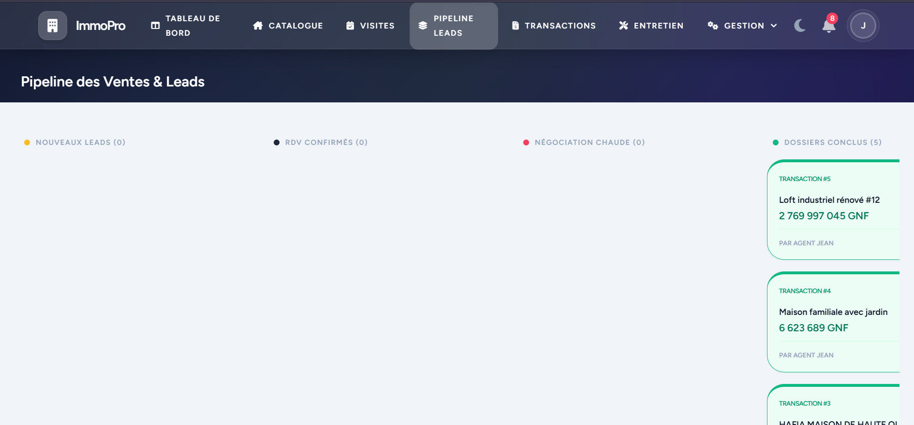
Tableau de suivi (style Kanban) pour visualiser l'avancement des négociations et des dossiers conclus.

## 21. Historique des Transactions

Liste complète des ventes et locations finalisées avec le calcul des commissions pour l'agence.

## 22. Détails de la Transaction de Vente
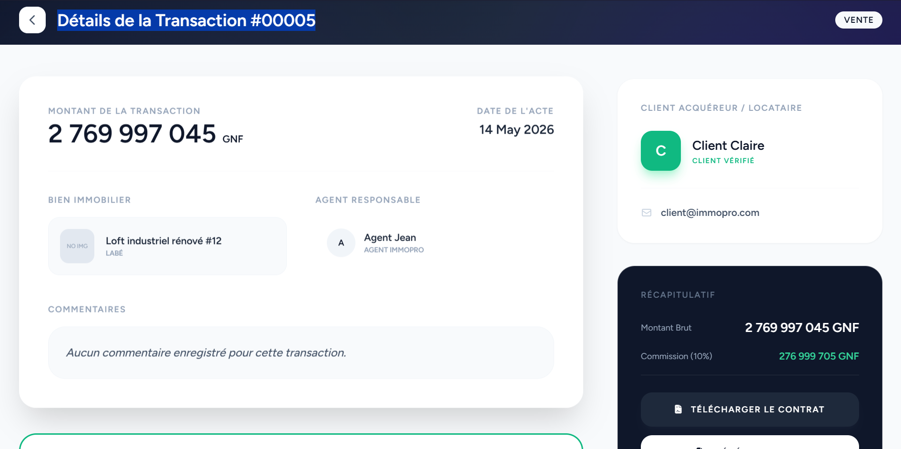
Fiche récapitulative d'une transaction, montrant l'acquéreur, le montant brut, la commission et le contrat téléchargeable.

## 23. Signatures Numériques et Contrats
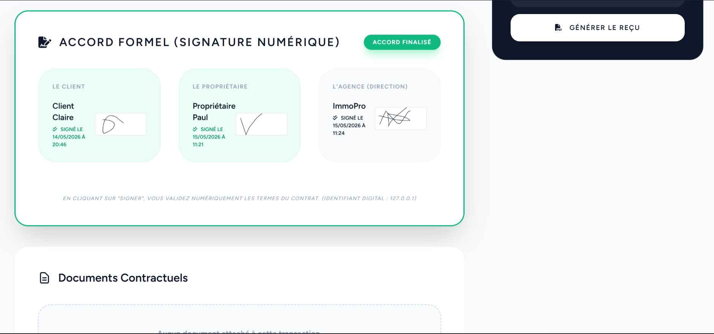
Système d'accord formel affichant les signatures numériques et horodatées des différentes parties (client, propriétaire, agence).

## 24. Détails d'une autre Transaction

Un autre exemple de récapitulatif financier d'une transaction.

## 25. Vues complémentaires d'Administration
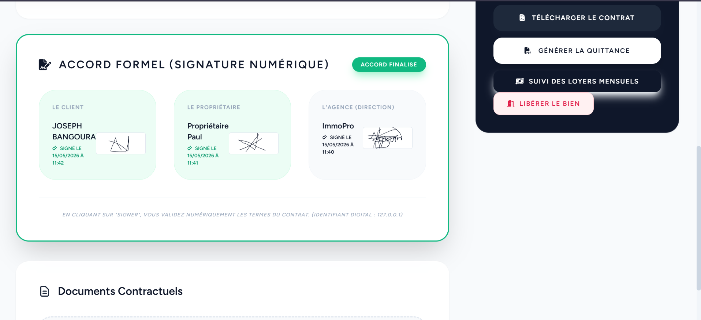
Vue détaillée d'une partie de la gestion des accords et contrats.

## 26. Vues complémentaires d'Administration
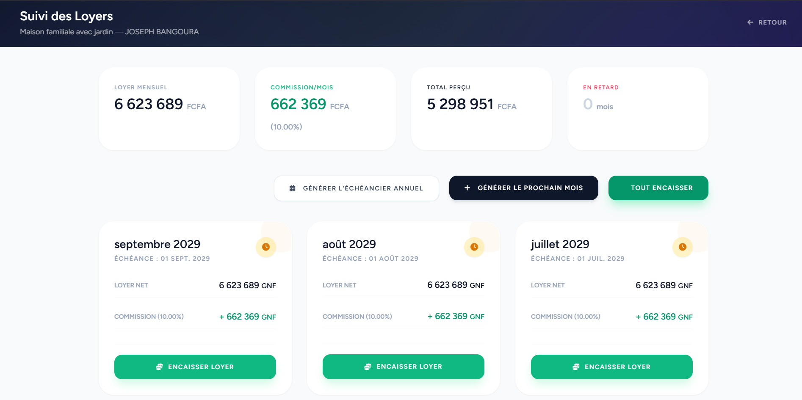
Autre vue issue des outils d'administration des biens ou des utilisateurs.

## 27. Gestion Opérationnelle

Aperçu des outils de gestion quotidienne des tâches de l'agence.

## 28. Outils et Configurations
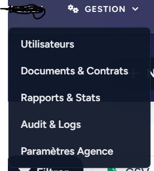
Interface dédiée à la configuration et à l'exploration des données de la plateforme.

## 29. Rapports Financiers (Suite)
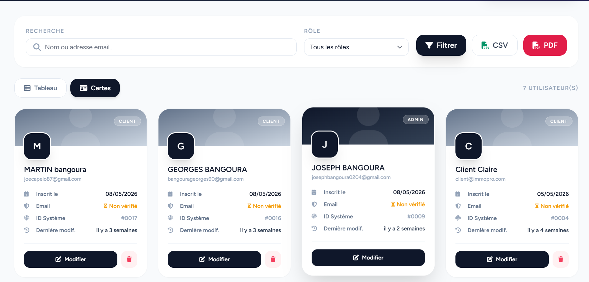
Aperçu détaillé des indicateurs de performance.

## 30. Notifications & Alertes

Interface listant les notifications récentes et alertes importantes pour l'agent.

## 31. Profil Utilisateur & Préférences
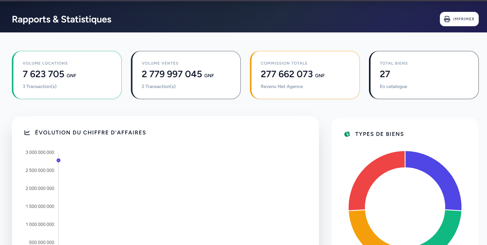
Menu permettant la gestion du compte personnel de l'utilisateur.

## 32. Options Visuelles
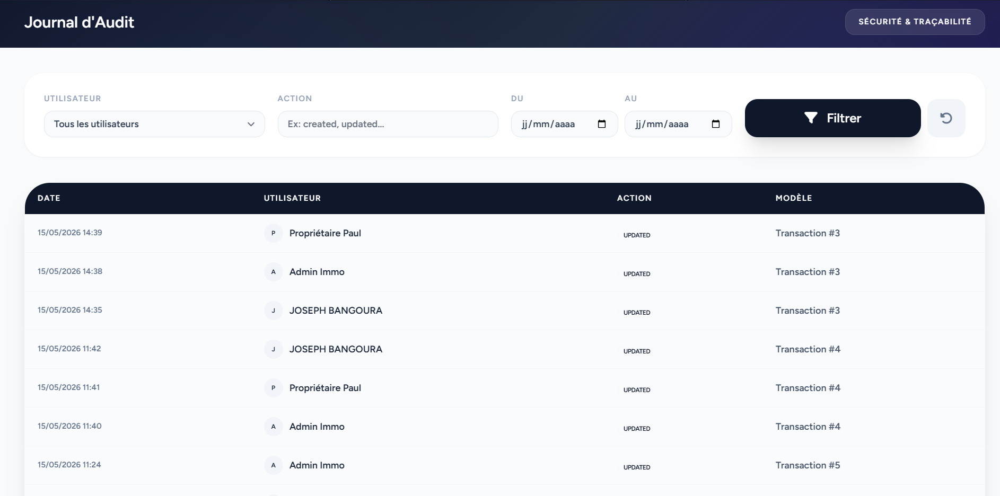
Réglages de l'interface, comme le basculement en mode sombre.

## 33. Outils Complémentaires
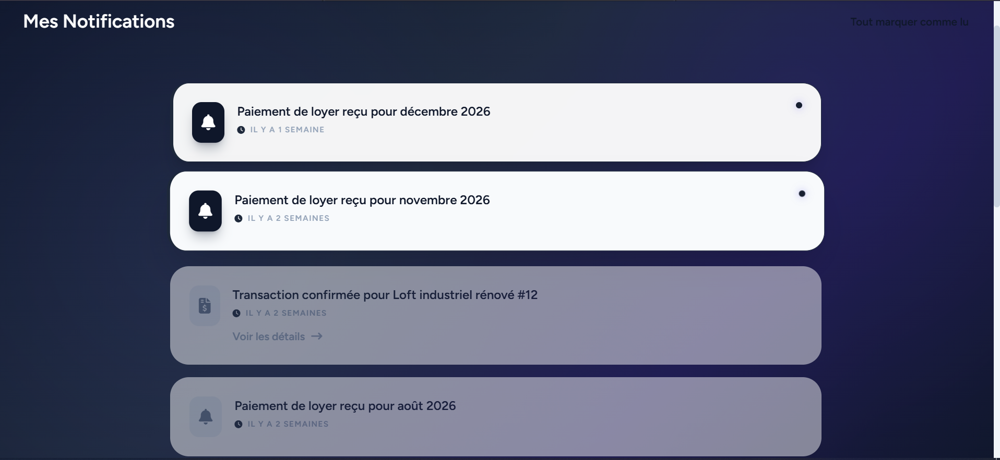
Autres outils utiles intégrés à l'application.

## 34. Écran Final

Vue globale pour terminer la présentation de l'interface d'ImmoPro.
